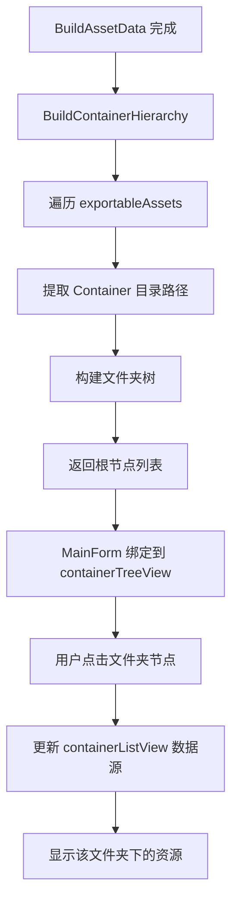

# Container Hierarchy 视图设计文档

> 日期: 2026-05-16
> 状态: 已确认

## 1. 概述

在 AssetStudio GUI 的左侧面板 tabControl1 中新增第四个 TabPage "Container Hierarchy"，基于 AssetItem 的 Container 路径字段构建文件夹树形结构，提供按路径浏览资源的能力。

### 1.1 需求摘要

- 新增 Container Hierarchy 视图作为第四个 TabPage
- 左侧：文件夹树形结构（TreeView），UI 参考 Scene Hierarchy
- 右侧：资源列表（ListView），复用 Asset List 样式
- 预览/Dump 继续使用主窗体右侧共享面板
- 左右两侧都支持复选框（用于导出选择）
- 仅当前文件夹资源，不包含子文件夹
- 仅左侧文件夹树支持搜索

### 1.2 布局结构

```
MainForm
  +-- SplitContainer (主水平分割)
       +-- Panel1 (左侧)
       |    +-- tabControl1
       |         +-- tabPage1 "Scene Hierarchy"  (现有)
       |         +-- tabPage2 "Asset List"       (现有)
       |         +-- tabPage3 "Asset Classes"    (现有)
       |         +-- tabPage4 "Container Hierarchy" (新增)
       |              +-- SplitContainer (水平分割)
       |                   +-- Panel1 (左侧, 30%)
       |                   |    +-- containerTreeSearch (TextBox)
       |                   |    +-- containerTreeView (TreeView)
       |                   +-- Panel2 (右侧, 70%)
       |                        +-- containerListView (ListView, 虚拟模式)
       +-- Panel2 (右侧)
            +-- tabControl2 (Preview / Dump, 共享)
```

## 2. 方案选择

### 方案 A (选定) - 新增第四个 TabPage

在 tabControl1 中新增 tabPage4，内部用 SplitContainer 分为左右两部分。

**优点:**
- 与现有三个 TabPage 架构完全一致
- 复用右侧共享的 Preview/Dump 面板
- 代码改动最小，不影响其他视图

**排除的方案:**
- 方案 B (改造 Scene Hierarchy) - 改动大，影响现有功能，风险高
- 方案 C (独立窗口) - 交互割裂，用户体验不连贯

## 3. 左侧文件夹树

### 3.1 数据构建

在 `Studio.cs` 中新增 `BuildContainerHierarchy()` 方法:

1. 遍历 `exportableAssets`，筛选有非空 `Container` 的资源
2. 从 Container 路径提取目录部分:
   - 有扩展名 (如 `"assets/textures/ui/icon.png"`) -> 目录为 `"assets/textures/ui"`
   - 无扩展名 (如 `"assets/textures/ui"`) -> 本身就是文件夹
3. 按 `/` 分割路径，构建 `Dictionary<string, ContainerTreeNode>` 形成文件夹树
4. 无 Container 的资源归入 "(No Container)" 虚拟根节点

### 3.2 节点数据结构

```csharp
// 文件: AssetStudio.GUI/Components/ContainerTreeNode.cs
public class ContainerTreeNode : TreeNode
{
    public string FullPath;           // 完整路径如 "assets/textures/ui"
    public List<AssetItem> Assets;    // 直接属于该文件夹的资源
}
```

### 3.3 控件配置

- 标准TreeView (不需要 GOHierarchy, 因为不需要 GameObject 关联)
- `CheckBoxes = true` -- 勾选文件夹时递归勾选子文件夹和资源
- `HideSelection = false` -- 失去焦点保持高亮
- 顶部搜索框 `containerTreeSearch`，支持正则搜索文件夹名

### 3.4 复选框行为

- 勾选文件夹 -> 递归勾选所有子文件夹节点
- 勾选/取消父文件夹 -> 对应右侧列表中该文件夹下所有资源的选中状态联动
- 勾选根节点 -> 勾选所有子节点

## 4. 右侧资源列表

### 4.1 控件配置

- `ListView`，虚拟模式 (`VirtualMode = true`)
- `CheckBoxes = true` -- 带复选框
- 列: Name, Container, Type, PathID, Size (与 Asset List 相同)
- 数据源: 选中文件夹节点的 `Assets` 列表

### 4.2 交互逻辑

- 点击左侧文件夹节点 -> 右侧显示该文件夹直接包含的资源
- 选中右侧列表项 -> 主窗体右侧 Preview/Dump 面板显示预览
- 勾选左侧文件夹 -> 自动勾选右侧该文件夹下所有资源
- 勾选左侧父文件夹 -> 递归勾选所有子文件夹及其下所有资源

## 5. 数据流

### 5.1 构建时机

在 `Studio.BuildAssetData()` 完成后调用 `BuildContainerHierarchy()`:
- 此时 `exportableAssets` 已构建完成
- 所有 Container 字段已赋值
- 返回 `List<ContainerTreeNode>` 供 MainForm 绑定

### 5.2 数据流图



## 6. 代码修改清单

| 文件 | 修改内容 |
|------|----------|
| `AssetStudio.GUI/Components/ContainerTreeNode.cs` | 新增节点类 |
| `AssetStudio.GUI/Studio.cs` | 新增 `BuildContainerHierarchy()` 方法 |
| `AssetStudio.GUI/MainForm.Designer.cs` | 新增 tabPage4 及内部控件 |
| `AssetStudio.GUI/MainForm.cs` | 新增事件处理、集成导出流程 |
| `AssetStudio.GUI/MainForm.cs` | 扩展 `tabPageSelected` switch case |

### 6.1 MainForm.cs 新增事件

- `containerTreeView_AfterSelect` -- 文件夹选中时更新右侧列表
- `containerTreeView_AfterCheck` -- 复选框联动
- `containerTreeSearch_KeyDown` -- 搜索功能
- `containerListView_RetrieveVirtualItem` -- 虚拟模式数据提供
- `containerListView_ItemSelectionChanged` -- 资源选中时触发预览
- `containerListView_ItemCheck` -- 资源勾选状态管理

### 6.2 导出集成

- 从 `containerListView` 读取勾选项
- 与现有导出流程整合
- 导出路径沿用 Container 路径结构

## 7. ASCII 界面参考

```
+-------------------------------------------------------------------+
| File  Edit  Export  Filter  Options  View  Help                    |
+-------------------------------------------------------------------+
| [Scene Hierarchy][Asset List][Asset Classes][Container Hierarchy]  |
+---------------------------+---------------------------------------+
| [Search folders...]       | Name       |Container|Type|Size      |
+---------------------------+------------+---------+----+----------+
| v assets                  | icon_01    |assets/..|Tex | 12.3 KB  |
|   v textures              | icon_02    |assets/..|Tex | 8.7 KB   |
|     v ui                  | bg_main    |assets/..|Tex | 256 KB   |
|       icon_folder         | logo       |assets/..|Tex | 64.2 KB  |
|     characters            |            |         |    |          |
|   audio                   |            |         |    |          |
|   models                  |            |         |    |          |
| (No Container)            |            |         |    |          |
+---------------------------+------------+---------+----+----------+
| Progress: ████████████ 100%                                       |
+-------------------------------------------------------------------+
| Preview panel (shared)                                             |
|                                                                    |
|  [Preview]                                                         |
|  +----------------------------------------------------------+     |
|  |                                                          |     |
|  |           asset preview area                             |     |
|  |                                                          |     |
|  +----------------------------------------------------------+     |
+-------------------------------------------------------------------+
```
